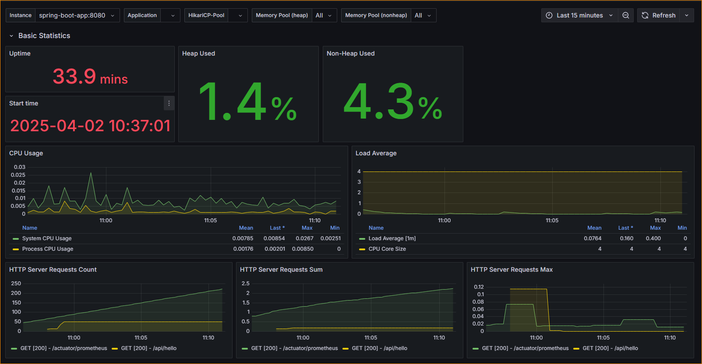

# OpenTelemetry Collector: Pushing Metrics to Prometheus




## Can OpenTelemetry Collector Push Metrics to Prometheus?

Yes, OpenTelemetry Collector **can push metrics to Prometheus** using the `prometheusremotewrite` exporter. However, it does **not** push metrics to Prometheus directly in the traditional pull-based model. Instead, it sends metrics via remote write to a **Prometheus-compatible endpoint**.

### How Prometheus Works with OpenTelemetry Collector

- **Prometheus Pull Model:** Prometheus usually scrapes metrics from applications that expose an HTTP endpoint (`/metrics`).
- **Otel Collector Push Model:** OpenTelemetry Collector does not natively expose metrics for Prometheus to scrape but instead **pushes** them using `prometheusremotewrite`.In a load balancer faced multi task ECS service it becomes really difficult to expose metrics via IP address. Hence a push based metric exporter is used.

## Configuration to Push Metrics to Prometheus

Modify your **otel-collector-config.yaml** file to use `prometheusremotewrite`:

```yaml
receivers:
  prometheus:
    config:
      scrape_configs:
        - job_name: 'spring-boot-app'
          scrape_interval: 5s
          static_configs:
            - targets: ['spring-boot-app:8080']
          metrics_path: "/actuator/prometheus"

exporters:
  prometheusremotewrite:
    endpoint: "http://prometheus:9090/api/v1/write"  # Push metrics to Prometheus

service:
  pipelines:
    metrics:
      receivers: [prometheus]
      exporters: [prometheusremotewrite]
```
### Key Configuration Details

- **`endpoint`**: Points to the Prometheus **remote write endpoint**.
- **`receiver`**: Receiver starts fetching metrics from the Spring boot app
- **`timeout`**: Defines the request timeout for pushing metrics.
- **`batch processor`**: Ensures metrics are sent efficiently in batches.

## Alternative: Allow Prometheus to Scrape OpenTelemetry Collector

If you want **Prometheus to pull metrics** instead of remote write, configure the `prometheus` exporter:

```yaml
exporters:
  prometheus:
    endpoint: "0.0.0.0:9464"
```
This will expose metrics at `http://otel-collector:9464/metrics`, which Prometheus can scrape by adding the following scrape config:

```yaml
scrape_configs:
  - job_name: "otel-collector"
    static_configs:
      - targets: ["otel-collector:9464"]
```
## Steps to Run the Project

### Prerequisites

- Install Docker & Docker Compose
- Build the spring boot app using mvn install

### Running OpenTelemetry Collector

```sh
docker-compose up -d otel-collector
```
### Running Prometheus

```sh
docker-compose up -d prometheus
```
### Verifying the Setup

1. **Check OpenTelemetry Collector Logs:**
   ```sh
   docker logs -f otel-collector
   ```
2. **Verify Prometheus Metrics:**
   - Open `http://localhost:9090/targets` in a browser to check if Prometheus is receiving metrics.
   - Run:
     ```sh
     curl -X GET http://localhost:9090/api/v1/status/config
     ```
3. **Check Metrics in Prometheus UI:**
   - Visit `http://localhost:9090` and search for `otelcol_exporter_sent_metric_points`

## Troubleshooting

### Issue: `remote write receiver needs to be enabled`

- Start Prometheus with the flag:
  ```sh
  --web.enable-remote-write-receiver
  ```

## Summary


| Method                  | Configuration                    | Best Use Case                            |
| ----------------------- | -------------------------------- | ---------------------------------------- |
| **Push (Remote Write)** | `prometheusremotewrite` exporter | When Prometheus remote write is required |
| **Pull (Scraping)**     | `prometheus` exporter            | When Prometheus needs to scrape directly |

Both methods work, but **remote write is preferred** when dealing with **distributed OpenTelemetry architectures**.

---

This guide provides a clear understanding of how to push OpenTelemetry metrics to Prometheus. 🚀
